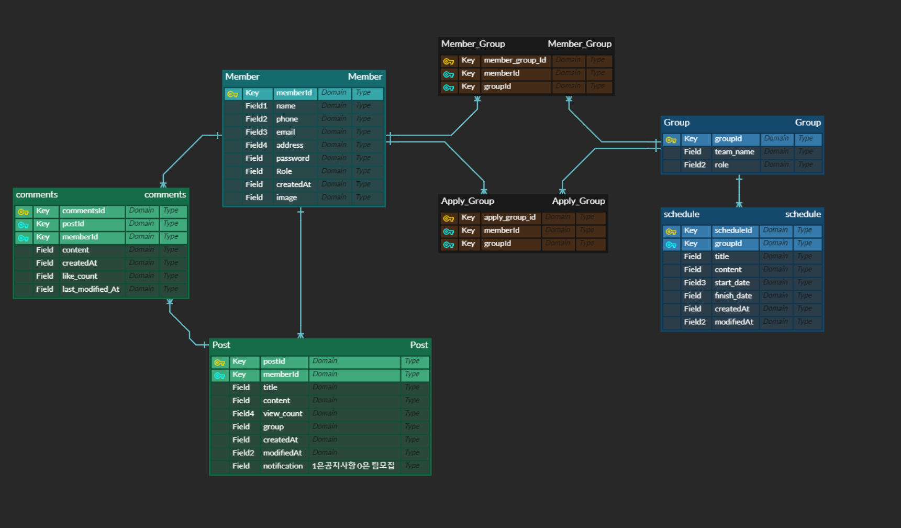

# 📒 StudyRoom

## 🖥 사용자 인터페이스(UI)

- 추가 예정

## ⚙️ 개발 환경(Development Environment)

| 분류 | 개발환경 | 
|---|---|
| 운영체제 | Windows 10 64bit |
| 개발도구 | Intellij IDEA, Gradle |
| 프레임워크 | Spring Boot 2.7.1 |
| 데이터베이스 | MYSQL (Release 13.7) |
| 버전 관리 | Github, Git |
| 배포 및 운영 | AWS EC2, AWS RDS, AWS S3, Docker, Github Actions  |
| 오픈소스 및 외부 라이브러리 | Naver API, Kakao API |

## 🛠 세부 기술 스택(Tech Stack)

### 백엔드(Back-end)
- **Java 11**
- **Spring Boot 2.7.1**
	- Spring Web MVC
	- Spring Data JPA
	- Spring Security

### 데이터베이스(Database)

- **MySQL (Release 13.7)**

### ETC

- 추가 예정

## 📝 도메인 모델 분석(Domain Model Analysis)

### 회원(Member)

- 회원과 게시글의 관계 : 회원은 여러 개의 게시글을 작성할 수 있다.(1:N)
- 회원과 댓글의 관계 : 회원은 여러 개의 댓글을 작성할 수 있다.(1:N)
- 회원과 그룹의 관계 : 회원은 여러 개의 그룹에 들어갈 수 있다.(1:N)
- 회원과 신청의 관계 : 회원은 여러 개의 신청을 갖을 수 있다.(1:N)

### 게시글(Post)

- 게시글과 회원의 관계 : 회원은 여러 개의 게시글을 작성할 수 있다.(N:1)
- 게시글과 댓글의 관계 : 게시글에는 여러 개의 댓글이 작성될 수 있다.(1:N)

### 댓글(Comments)

- 댓글과 게시글의 관계 : 게시글에는 여러 개의 댓글이 작성될 수 있다.(N:1)
- 댓글과 회원의 관계 : 회원은 여러 개의 댓글을 작성할 수 있다.(N:1)

### 그룹(Group)

- 그룹과 회원의 관계 : 그룹은 여러 명의 회원을 갖을 수 있다.(1:N)
- 그룹과 일정의 관계 : 그룹은 여러 개의 일정을 갖을 수 있다.(1:N)
- 그룹과 신청의 관계 : 그룹은 여러 개의 신청을 갖을 수 있다.(1:N)

### 일정(Schedule)

- 일정과 그룹의 관계 : 그룹은 여러 개의 일정을 갖을 수 있다.(N:1)

### 신청(Apply)

- 신청과 회원의 관계 : 회원은 여러 개의 신청을 갖을 수 있다.(N:1)
- 신청과 그룹의 관계 : 그룹은 여러 개의 신청을 갖을 수 있다.(N:1)

## 📝 요구사항 분석(Requirements analysis)

- [바로가기](./documents/Requirements-analysis.md)

## 🔗 엔티티-관계 모델(Entity Relationship Diagram)

## 📐 트러블 슈팅(Trouble Shooting)

- 추가 예정
